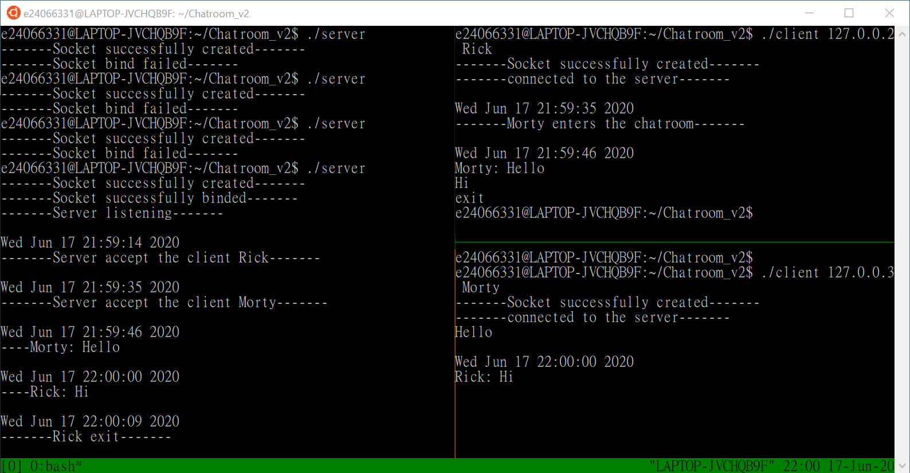
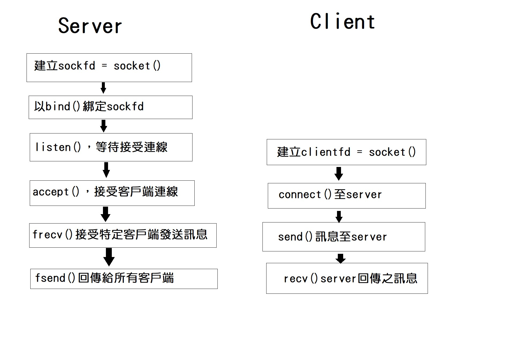

# Chatroom
### A. Execution
For sever:
```
./server
```

For client(x should be different number for different client):
```
./client 127.0.0.x user_name
```
* At most ten clients
* Clients can enter "exit" to exit the chatroom

Execution result:


### B. Briefly describe the workflow and architecture of the system.
架構圖:

#### 函式使用架構:
Server端:
```c
getaddrinfo();	//取得本地資訊
socket();		//在kernel建立一個socket
bind(); 		//綁定socket()到本地主機上
listen()		//等待用戶連線
accept()		//接受用戶連線
while(true)
{	//以fork()執行接收，傳送資料
	recv()	//from a client
	…
	send()	//to all client
}
```

Client端:
```c
getaddrinfo();	//取得本地資訊
socket();		//在kernel建立一個socket
connect();	//連線至server(遠端主機)
while(true)
{	//以fork()執行接收，傳送資料
	send()	//to server
	…
	recv()	//from server
}
```
#### 流程:

### C. Explain the solution of synchronization problems in this project.
在這個系統中會出現同步存取導致錯誤的部分為server端的frecv函式，當有超過1個client傳送訊息給server，會因為不同執行緒同時使用shared memory導致server可能只能存取最後接收到的訊息，故這裡我們必須使用semaphore來保證只有一個thread能存取，並將其strcpy出來後才能讓下一個thread使用shared memory。實作部分如下:
```c
while(new_message) // wait until all the threads sent the message (new_message=0)
  ;
sent_clientfd= *(int*)sockfd; // remember the client that sent the message
strcpy(ShareM, buff); // Put the received message into Share memory
new_message=1;  
sem_post(&mutex); // semaphore signal
```
而其中`while(new_message)`為busy-waiting，目的是要等新訊息傳出後，才能讀取下一則新訊息，否則shared memory裡面的訊息會被新讀取的訊息覆蓋，導致有些client會少接受到某些訊息。
### D. Discussion

1. 有關socket函式之學習:
```c
int getaddrinfo(*node , *service , struct
   addrinfo *hints , struct addrinfo **res )
```
* node為連線主機名字或IP、address
service是服務代碼，可以是port或http等等
hint為使用者已填好之struct addrinfo
res為傳入函式後，函式會將其填好資料傳回之結果
若執行錯誤，則回傳小於0之值

```c
int socket(int domain, int type, int protocol)
```
* domain用以設定socket類型，IPv4或IPv6
protocol設定為0即可
type為設定適當協定，例如TCP或UDP
而socket()回傳值為一個sys_call會用到之file descriptor

```c
int bind(int sockfd, struct sockaddr *local_addr , int addrlen)
```
* sockfd即socket()回傳之file descriptor
local_addr指向自己的各種位址資訊
addrlen為位址長度，單位為byte
bind之功用為將socket()綁定到執行程式之主機上

```c
int connect(int sockfd, struct sockaddr *serv_addr, int addrlen)
```
* sockfd即`socket()`回傳之file descriptor
serv_addr指向將要連線的主機之各種位址資訊
addrlen為位址長度，單位為byte
connect()用來和遠端之主機建立連線

```c
int listen(int sockfd, int backlog)
```
* sockfd即socket()回傳之file descriptor
backlog為進入等待佇列的允許數目
listen()為等待遠端主機進入連線，此時本地端為server的角色

```c
int accept(int sockfd, struct sockaddr *addr, addrlen)
```
* sockfd即socket()回傳之file descriptor，和listen()之sockfd為同一個
addr指出進來的連線將往哪裡去
addrlen為位址長度，在accept()前設定為sizeof(struct sockaddr_storage)
accept()用來接受等待進入之連線，處理佇列中之等待物件

```c
int send(int sockfd, *msg, int len, int flags)
```
* sockfd為使用者欲傳送資料過去之file descriptor(不論來源)
msg為指向想傳送資訊之指標
len為資料長度，單位為byte
flags設為0即可
send()用以傳送資料，回傳值為實際傳送資料byte數
```c
int recv(int sockfd, *buf, int len, int flags)
```
* sockfd為讀取資料之file descriptor(不論來源)
buf為指向紀錄讀取到的資訊之緩衝區
len為緩衝區大小，單位為byte
flags設為0即可
當遠端關閉連線時，recv回傳值為0


2.	有關pthread之函式

產生new thread:
```c
int pthread_create (pthread_t *thread,		//使用之child thread
			     pthread_attr_t *attr, //init()產生
			     void *(*start_routine)(void *),	//欲執行之函式
			     void *arg); //欲執行函式之參數
```

* 用來建立新的thread，回傳thread_id(失敗為-1)
```c
int pthread_join (pthread_t target_thread //要等待之target_thread
                void **thread_return_status ); //target_thread之結束狀況
```
* 等待target_thread執行結束後，再執行parent thread剩下之程式碼

處理同步問題-使用semaphore.h:
```c
int sem_init(sem_t *sem, int pshared, unsigned int value);
```
* pshared為可同步之process數量
value為旗標初始值
```c
int sem_post(&semaphore);
```
* 將semaphore等待佇列中放入一個新job
```c
int sem_wait(&semaphore);
```
* 判斷是否有未處理之job，若有則thread進入

Semaphore運行結構:
```c
void* child()
{
	sem_wait(&semaphore);
	…
	Critical Section
	…
	sem_post(&semaphore)
}
```
### E. To do
* 記事本功能
* 顏文字圖功能
* 已讀功能
